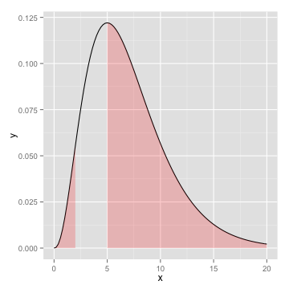

## What it is?
This is a Shiny application which allows to calculate percentiles of distributions, displaying both the grafical and numerical result. 
Once the distribution is choosen and its parameters defined, the user will be able to choose which part of the distribution she is interested in. The corresponding area (i.e. the percentile) will be graphically highligthed in red in the plot, while the corrisponding numerical value will be quantified at the bottom of the page. The application currently includes the most common statistical distributions: 

1. Gaussian
2. t-Student
3. f distribution
3. Chi-squared

Application link: https://maurogentile.shinyapps.io/PercentileCalculator/  
Source files (ui.R, server.R) links: https://github.com/MauroGentile/DataProducts/tree/master

---

## How to use it?

You can calculate the desired percentile following simple intuitive steps:  

1. Choose the distribution you want to work with
2. Select the upper limit of the visualization window. This parameter allows to zoom in/out or to shift the display window horizontally. The lower limit will be eiher the inversed input or 0 depènding on the distribution. 
3. Input the parmameters which define the distribution (mean and sd for the Gaussian, the degree of freedom for the t-Student etc.)
4. Define the area of the distribution your are interestd in (one tail, outer or inner range)
5. Input either the cut off value (in case of one tail), or the upper and lower interval limits (in case of outer and inner range).
7. Check the graph (area of interested highligthed in red) and read the percentile value at the bottom of the page (you may be required to scroll down to display this result)

--- 

## Example: Problem statment and parameters setting 
PROBLEM:  
Given a Chi-squared distribution with 7 degrees of freedom, you are interested in calculating the percentile of in the outer range of [2, 5] i.e for x<2 and x>5


PARAMETR SETTING:  
In the calculator do the folowing:  
1. distribution: choose "Chi-squared""  
2. upper limit of visualization range: set to "20" (the lower bound will be automatically set to 0)  
3. degree of freedom: set to "7"  
4. select the range: choose "outer range"  
5. lower bound: set to "2"  
6. upper bound: set to "5"  

  
OUTPUT IN THE NEXT SLIDE->
--- 

## Example: Graphical and numerical output 

 


```
## [1] 0.7001
```

